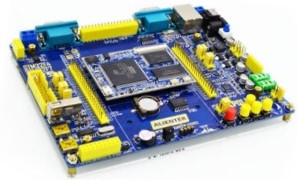
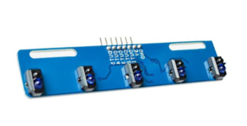

# Vision Line Follower


## Introduction
This repo is part of a line follower bot project, especially the simulation and PID controllers in Webots for fast algorithm validations. Besides, a hardware sim-to-real solution is given by serial USART communication between Raspberry Pi Zero and STM32H7 MCU.


## Simulation

### Model and Sensors
One camera and 5 infrared (IR) sensors are mounted on the four-wheel drive car. Based on given sensors, two control algorithm is setup in Webots simulation for fast validations. Note that there is no feedback on the motor.


### IR Controller
This controller steers the car differentially in proportion to the position of triggered IR sensors. The integral and derivative terms are used for correction only, since a discrete PID with 5 ways IR sensor is very unstable.

```python
ID_data = [getIRValue(sensor) for sensor in sensors]
# print(traces)

err = getError(pos, ID_data)
err_I += err # zero this when outline
PD_feedback = KP * err + KD * (err - err_D) + KI * err_I
err_D = err

left_vel = 0.5 * MAX_VEL - PD_feedback
right_vel = 0.5 * MAX_VEL + PD_feedback
# print(left_vel, right_vel)

setLeftWheel(left_vel)
setRightWheel(right_vel)
```
### Vision Controller

By using the camera to observe the track, we can close the loop for speed control. The vision servo uses the deviation feedback between the body and the black line to control the angular speed of the car and uses the center of the black line in the vertical direction to regulate the speed of the car.

#### Process Image 
```python
img = np.array(camera.getImageArray()).astype(np.uint8)  # (240, 320, 3)
img_gray = cv2.cvtColor(img, cv2.COLOR_RGB2GRAY)
img_gray = cv2.erode(img_gray,
                        cv2.getStructuringElement(cv2.MORPH_ERODE, (5, 5)),
                        iterations=2)
_, img_thr = cv2.threshold(img_gray, 0, 255, cv2.THRESH_OTSU)
```

<!-- TODO add images -->

#### Calculate Line Center
Count only `LINE_COUNT` lines in the image from `LINE_START`.
```python
centers = []
for i in range(LINE_COUNT):
    line = img_thr[LINE_START + i, :]
    black_count = np.sum(line == 0)
    black_index = np.where(line == 0)[0]  # uppack tuple (320,)
    center = (black_index[0] + black_index[black_count - 1]) / 2
    centers.append(center)
    line_center = np.sum(centers) / len(centers)
```

#### Credits
- The track is made using CAD model from @DrakerDG.
- The idea of speed control in y axis is from @Nokkxz.


### Sim-to-Real Gap

- Wheel contact properties
- Camera noise
- Cast shadow
- Controller delay

## Hardware

### Line Follower Bot

### Raspberry Pi Zero with Pi Camera


### STM32H7




### IR Sensors



### Communications

Serial USART